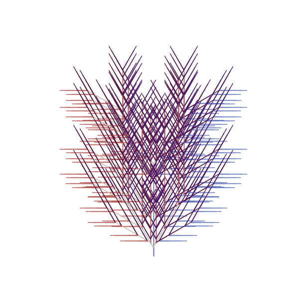
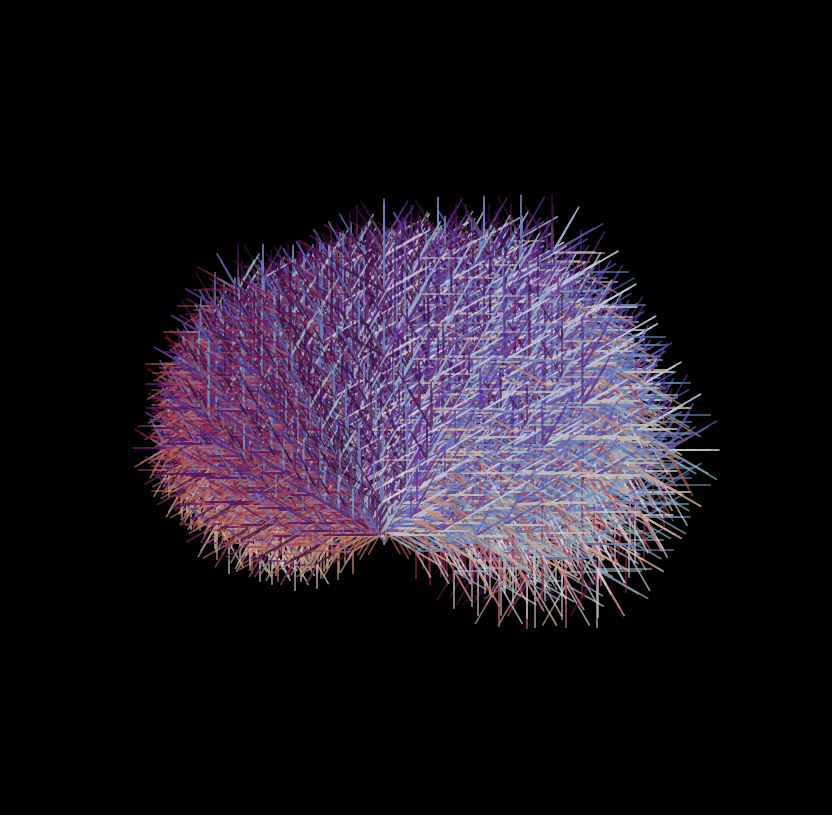

# Golomb Rulers: History and Purpose  

Golomb rulers were invented by **Solomon W. Golomb** in the 1950s. They are sets of marks at integer positions along a ruler such that no two pairs of marks have the same distance. Originally studied in **combinatorial mathematics**, Golomb rulers have practical applications in:  

- **Radio astronomy** (minimizing interference in antenna arrays).  
- **X-ray crystallography** (improving measurement accuracy).  
- **Error correction codes** (helping with unique signal identification).  

## Golomb Ruler-Based Fractal Trees  

This project introduces a novel algorithm for generating fractal tree structures based on Golomb ruler sequences. By utilizing the unique, non-repetitive intervals of Golomb rulers to define branch lengths and placement, the method creates structured yet non-uniform growth patterns that expand recursively with each depth level.

Two variants are availabe

- **Basic Variant:** Uses a **Golomb ruler to generate fractal-like trees** by defining branch placement.

- **Enhanced Variant:** Introduces **dynamic branching angles, irregular growth, and glowing effects** for a more visually striking and organic fractal.  

### Basic Variant: Structured Fractal Growth  

- The Golomb ruler defines branch placement, ensuring unique spacing.  
- Recursive depth levels expand the fractal tree.  
- **Fixed branching angles** (±30°) create a uniform structure.  
- Colors are assigned based on both **angle and depth** for clarity.  

This approach blends **combinatorial mathematics with fractal geometry**, producing intricate branching structures.  

### Enhanced Variant: Naturalistic Growth & Glowing Effects  

- **Branching angles are dynamically adjusted** based on Golomb mark values.  
- **Variable branch lengths** create a more organic feel.  
- **Enhanced color mapping** integrates depth, angle, and Golomb marks.  
- **Dark background and semi-transparent lines** introduce a glowing effect.  

This enhanced version amplifies aesthetic appeal while maintaining the mathematical structure of Golomb-based fractals.  

  

## How This Code Works  

The code **recursively generates a fractal tree-like structure** using a **Golomb ruler** to determine branching points. Here’s how it works:

### 1. User Input  

- The user selects an **N-value** (defining the Golomb ruler) and a recursion **depth**.  
- Example: If `N=5`, the ruler `{0, 1, 4, 9, 11}` determines branch positions.  

### 2. Recursive Fractal Growth  

- A **stack-based iterative method** (instead of recursion) prevents deep recursion issues.  
- The fractal starts at `(0,0)`, growing upwards (`π/2` radians).  
- **Basic Variant:** Each branch spawns two new branches at ±30° (`π/6`).  
- **Enhanced Variant:** Angles and lengths vary dynamically for a more natural look.  

### 3. Color Assignment (Depth & Angle Blending)  

- Instead of using depth alone for coloring, it blends **depth, angle, and Golomb mark values** into a **smooth gradient**.  
- Formula:  

    colors[line_count] = ((depth / max_depth) + (angle / (2 * np.pi)) + (mark / max_mark)) % 1.0  

- The `'twilight'` colormap ensures a visually appealing distribution.  
- The **enhanced version** incorporates **glowing effects** with semi-transparent lines.  

### 4. Plotting the Fractal  

- The code uses **Matplotlib** to plot the computed line segments.  
- Dense regions become visually distinct due to the angle-depth-based color mapping.  
- The **enhanced version** features a **dark background with glowing color effects**.  

## Why Are These Approaches Interesting?  

- **Golomb rulers provide a structured but non-uniform branching pattern** → creating a unique fractal.  
- **Color mapping by angle + depth + mark values** makes dense areas visually interesting.  
- **Iterative approach using a stack** avoids recursion depth issues in Python.  
- **The enhanced variant introduces more natural fractal growth and visually stunning effects.**  

This project demonstrates the intersection of **mathematics, fractal geometry, and aesthetic visualization**.

